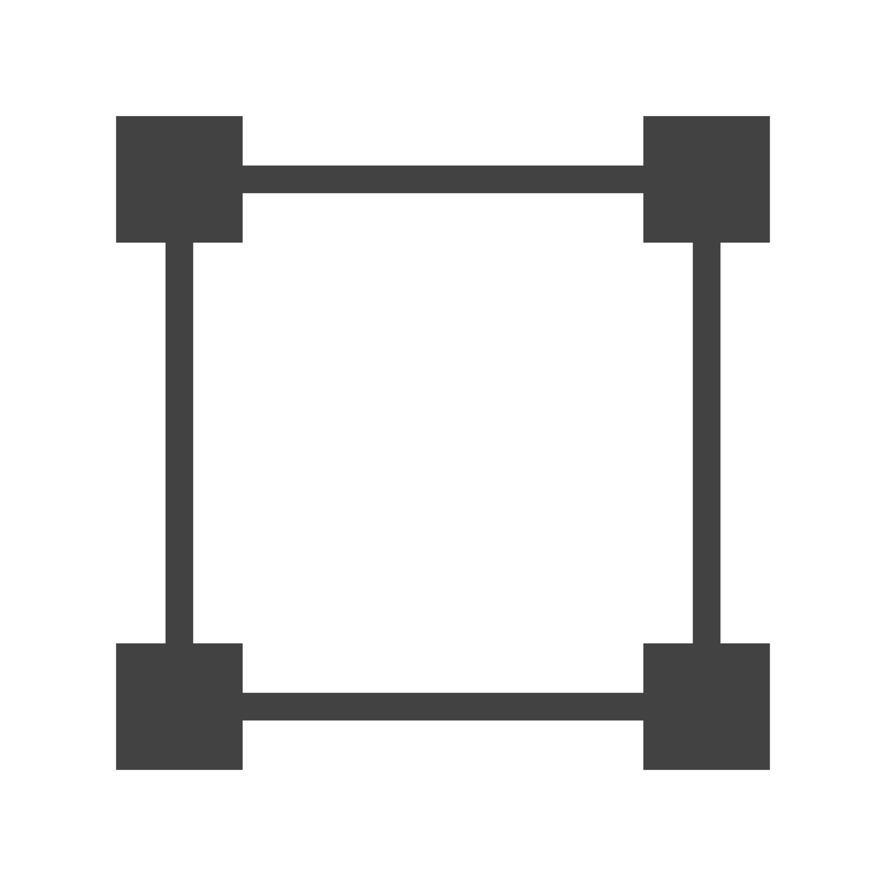
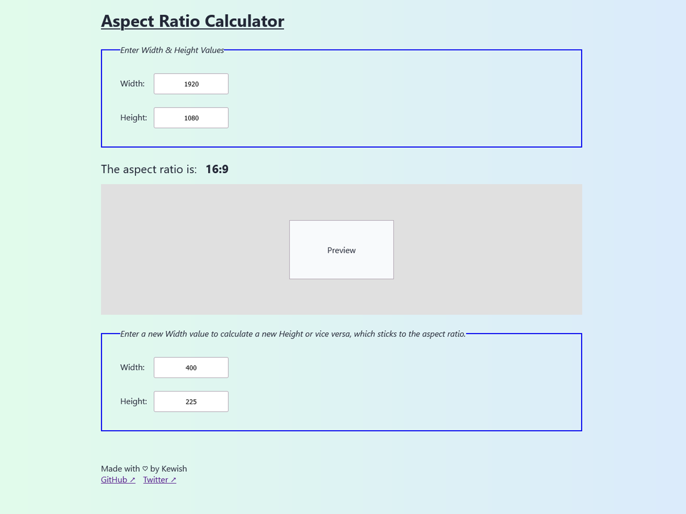

<p align="center"></p>

# Aspect Ratio Calculator

I often find myself resizing images but need to keep the new image at the same aspect ratio of the original.
I tend to usually only have the width or the height of what the resized image should be.
This is a small aspect ratio calculator experiment to calculate the missing width or height sticking to the 
aspect ratio of the original image. This project serves me for that particular use case.



## Run Locally

Clone the project

```bash
git clone https://github.com/kewishfagoe/aspect-ratio-calculator.git aspect-ratio-calculator
```

Navigate to the project source directory

```bash
cd ./aspect-ratio-calculator/src/
```

Open the index.html file directly in your browser or serve it with a local server.

```bash
start ./index.html
```

Install NPM dependencies to build project

```bash
npm ci
```

## Tech Stack

- HTML & CSS
- JavaScript

## Acknowledgements

 - [Favicon used](https://www.reshot.com/free-svg-icons/item/four-nodes-VUYNT4S7RW/)
 - A great read on [how aspect ratios are calculated](https://infocomm.org/filestore/av-math-online/groups/22.html)

## License

[MIT](/LICENSE)
